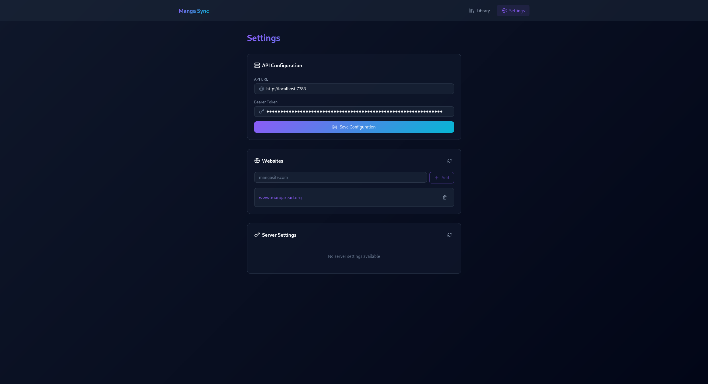
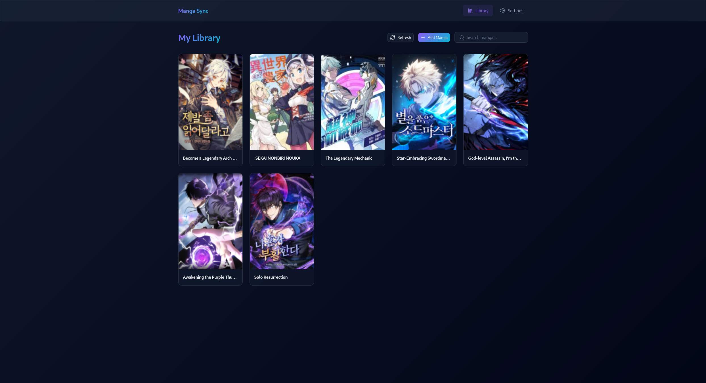
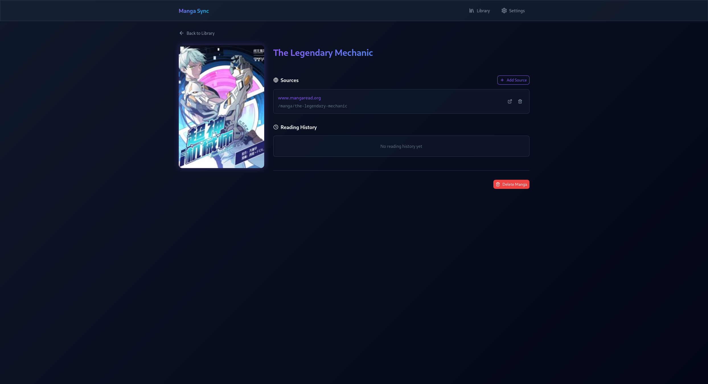
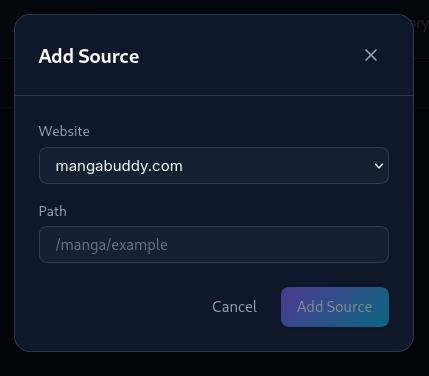
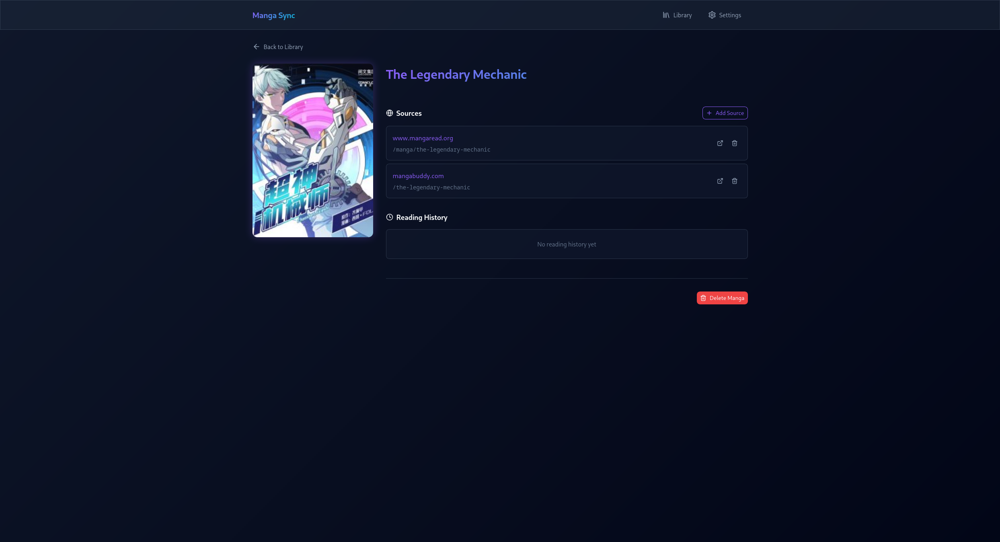
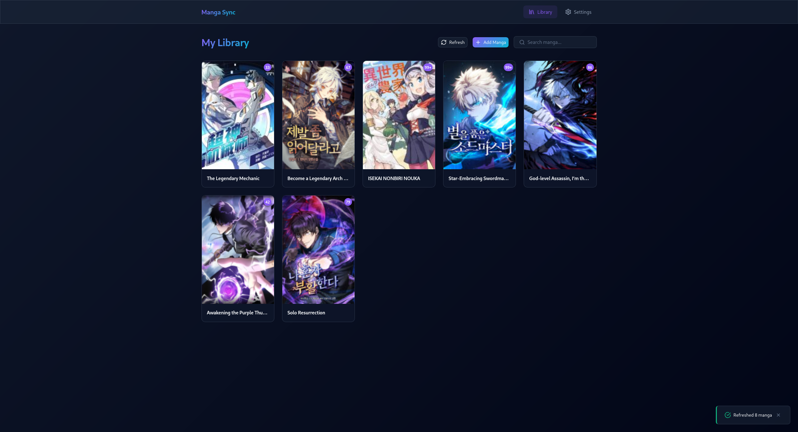
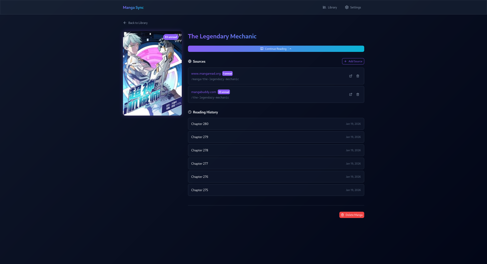

# Manga Sync

A Firefox Web Extension for managing and syncing your manga reading progress.

## Showcase

### Extension Webpage

1) **Settings page** - Configure the API URL and Bearer Token.



2) **Library page** - View added mangas in a responsive grid layout.



3) **Manga detail** - Manage sources, track reading progress and continue reading,



4) **Add source** - Add a new source to a manga.



5) Manga detail with 2 sources.



6) After refreshing unread chapters (with cron (each day), after reading a chapter or manually).



7) Manga detail with multiple sources and history.



### On a website

1) **Add a domain** - Add a new domain to the extension, visible only if the domain is not already added.


2) **Add a manga** - Add a new manga to the library (with the right click menu or the button on supported websites).


3) **Add a manga form** - Fill the form to add a new manga (pre-filled on supported websites).


## Features

- **Library Management**: View all your manga in a responsive grid layout
- **Manga Details**: View cover art, manage sources, and track reading history
- **Multiple Sources**: Link manga to multiple reading websites
- **Dark Theme**: Modern UI with gradients, glassmorphism, and smooth animations
- **Offline Storage**: API credentials stored locally in browser storage

## Installation

### From Source

1. Clone the repository:
   ```bash
   git clone https://github.com/yourusername/manga-sync-we.git
   cd manga-sync-we
   ```

2. Install dependencies:
   ```bash
   npm install
   ```

3. Build the extension:
   ```bash
   npm run build
   ```

4. Load in Firefox:
   - Open Firefox and navigate to `about:debugging#/runtime/this-firefox`
   - Click "Load Temporary Add-on..."
   - Select the `manifest.json` file from the `dist/` folder

## Development

```bash
# Start development server
npm run dev

# Build for production
npm run build

# Type check
npm run typecheck
```

## Configuration

On first launch, you'll need to configure the extension:

1. Click the extension icon to open Manga Sync
2. You'll be redirected to Settings
3. Enter your API URL (e.g., `http://localhost:7783`)
4. Enter your Bearer Token (the API will generate one for you).
5. Click "Save Configuration"

## API Requirements

This extension requires a compatible Manga Manager API backend, which can be found [here](https://github.com/PonyLucky/manga-sync).

## Refresh the Bearer Token

If using the default API backend, the token is shown only the first time in the logs in the API. To refresh it, you can delete the file `key.pub`.

## Tech Stack

- **Framework**: React 18
- **Language**: TypeScript
- **Build Tool**: Vite
- **Styling**: SCSS
- **HTTP Client**: Axios
- **Icons**: Lucide React
- **Routing**: React Router DOM

## Project Structure

```
src/
├── api/           # API service class
├── components/    # Reusable UI components
│   ├── Button/
│   ├── Card/
│   ├── Header/
│   ├── Input/
│   ├── Modal/
│   ├── Skeleton/
│   └── Toast/
├── context/       # React context providers
├── styles/        # Global SCSS styles
├── types/         # TypeScript interfaces
├── utils/         # Utility functions
└── views/         # Page components
    ├── AddManga/
    ├── Library/
    ├── MangaDetails/
    └── Settings/
```

## License

This project is licensed under the GNU AGPLv3 - see the [LICENSE](LICENSE) file for details.

